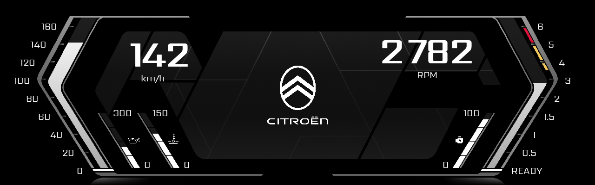
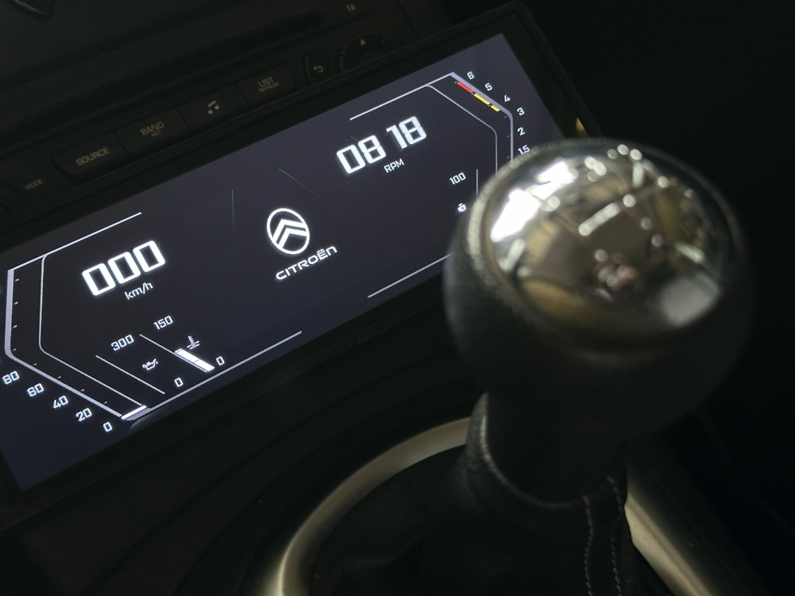

OBDII-Cockpit
=============

A real-time OBDII dashboard, running on a Raspberry Pi with a DSI display.
Powered by `py-obdii <https://github.com/PaulMarisOUMary/OBDII>`_.

Originally a private personal project, now open-sourced. Runs daily in my own car.

----

Features
--------

- Live display of speed, RPM, engine load, coolant temperature, oil temperature, and more
- Automatic blue light filter based on time of day
- Configurable polling frequency per OBD command
- Automatic reconnection on connection loss
- Rotating log files per session
- Development mode with simulator

Hardware
--------

- Raspberry Pi 3B+/CM4/CM5
- `Waveshare 7.9" DSI LCD <https://www.waveshare.com/7.9inch-dsi-lcd.htm>`_ (`Wiki <https://www.waveshare.com/wiki/7.9inch_DSI_LCD>`_)
- Any ELM327 compatible OBDII adapter (USB, WiFi, Bluetooth)

Raspberry Pi Setup
------------------

This guide explains how to setup a Raspberry Pi 3B+/CM4/CM5 with a Waveshare 7.9" DSI LCD and run a Python Pygame dashboard at boot, fully silent and fullscreen.

Prerequisites
^^^^^^^^^^^^^

Configure SSH, User (your_user) and WiFi before flashing the image.

Install Dependencies
^^^^^^^^^^^^^^^^^^^^

.. code-block:: bash

    sudo apt update && sudo apt upgrade -y

.. code-block:: bash

    sudo apt install libsdl2-dev libsdl2-image-dev libsdl2-mixer-dev libsdl2-ttf-dev -y
    sudo apt install python3-pygame -y

Add User to Video Group
^^^^^^^^^^^^^^^^^^^^^^^

.. code-block:: bash

    sudo usermod -aG video your_user

Create Project Directory & Virtual Environment
^^^^^^^^^^^^^^^^^^^^^^^^^^^^^^^^^^^^^^^^^^^^^^

.. code-block:: bash

    mkdir ~/Dashboard
    python3 -m venv --system-site-packages ~/Dashboard/.venv
    source ~/Dashboard/.venv/bin/activate
    pip install -r requirements.txt

Configure Display
^^^^^^^^^^^^^^^^^

Edit `sudo nano /boot/firmware/config.txt`:

.. code-block:: ini

    # For more options and information see
    # http://rptl.io/configtxt

    # Camera not used
    camera_auto_detect=0

    # Display explicitly declared below
    display_auto_detect=0

    # Automatically load initramfs files, if found
    auto_initramfs=1

    # Disable audio (snd_bcm2835)
    dtparam=audio=off

    # Enable DRM VC4 V3D driver
    dtoverlay=vc4-kms-v3d,noaudio
    max_framebuffers=2

    # Don't have the firmware create an initial video= setting in cmdline.txt.
    # Use the kernel's default instead.
    disable_fw_kms_setup=1

    # Run in 64-bit mode
    arm_64bit=1

    # Disable compensation for displays with overscan
    disable_overscan=1
    disable_splash=1

    avoid_warnings=1

    # Run as fast as firmware / board allows
    arm_boost=1

    [all]
    dtoverlay=vc4-kms-dsi-waveshare-panel,7_9_inch
    dtoverlay=disable-bt

Edit `sudo nano /boot/firmware/cmdline.txt` (all on one line):

.. code-block:: text

    video=DSI-1:400x1280e,rotate=90 console=tty1 cfg80211.ieee80211_regdom=FR root=PARTUUID=8adb8d1c-02 rootfstype=ext4 rcupdate.rcu_expedited=1 fsck.repair=yes initial_turbo=25 rootwait splash plymouth.ignore-serial-consoles quiet loglevel=3 systemd.show_status=0 vt.global_cursor_default=0 mitigations=off panic=5 systemd.crash_reboot=1

- Keep your own `root=PARTUUID=8adb8d1c-02`
- Same thing for `cfg80211.ieee80211_regdom=FR`

Suppress Login Prompt
^^^^^^^^^^^^^^^^^^^^^

.. code-block:: bash

    sudo systemctl disable getty@tty1.service

Create Systemd Service for Dashboard
^^^^^^^^^^^^^^^^^^^^^^^^^^^^^^^^^^^^

File: `sudo nano /etc/systemd/system/obd-dashboard.service`

.. code-block:: ini

    [Unit]
    Description=OBDII Dashboard
    DefaultDependencies=no
    After=systemd-udevd.service
    Requires=systemd-udevd.service

    [Service]
    Type=simple
    User=your_user

    WorkingDirectory=/home/your_user/Dashboard
    ExecStart=/home/your_user/Dashboard/.venv/bin/python3 -O main.py

    Restart=on-failure

    TTYPath=/dev/tty1
    TTYReset=yes
    TTYVHangup=yes

    StandardOutput=inherit
    StandardError=inherit

    AmbientCapabilities=CAP_SYS_NICE
    Nice=-10

    [Install]
    WantedBy=sysinit.target

Splash Screen
^^^^^^^^^^^^^

.. code-block:: bash

    sudo apt install plymouth plymouth-themes

    sudo nano /usr/share/plymouth/themes/spinner/spinner.plymouth

    # Edit: VerticalAlignment=.5

    sudo plymouth-set-default-theme -R spinner

Enable and Start Service
^^^^^^^^^^^^^^^^^^^^^^^^

.. code-block:: bash

    sudo systemctl daemon-reload
    sudo systemctl enable obd-dashboard.service
    sudo systemctl start obd-dashboard.service

Optimize Boot
^^^^^^^^^^^^^

See what services take time to start:

.. code-block:: bash

    systemd-analyze time

    systemd-analyze blame

    systemd-analyze critical-chain

    systemctl list-unit-files --state=enabled

.. code-block:: bash

    sudo systemctl disable NetworkManager-wait-online.service

    sudo systemctl disable bluetooth.service
    sudo systemctl disable hciuart.service

    sudo systemctl disable alsa-restore.service

    sudo systemctl disable ModemManager.service

    sudo systemctl disable rpi-eeprom-update.service
    sudo systemctl disable apt-daily.timer apt-daily-upgrade.timer

    sudo systemctl disable man-db.timer
    sudo systemctl disable sshswitch.service
    sudo systemctl disable avahi-daemon.service avahi-daemon.socket

    sudo systemctl disable fstrim.timer

    sudo systemctl disable console-setup.service
    sudo systemctl disable keyboard-setup.service

    sudo systemctl disable triggerhappy.socket triggerhappy.service

    sudo systemctl disable rpc-statd-notify.service

Optimization Results
^^^^^^^^^^^^^^^^^^^^

.. code-block:: text
    Model: Raspberry Pi 3 Model B Rev 1.2
    CPU: 4
    RAM: 927 MB
    Storage: 59500 MB

Optimization results:

.. code-block:: bash

    $ systemd-analyze time

    Startup finished in 5.788s (kernel) + 7.723s (userspace) = 13.512s
    multi-user.target reached after 7.497s in userspace.

.. code-block:: bash

    $ systemd-analyze critical-chain

    multi-user.target @7.497s
    └─ssh.service @6.441s +1.053s
    └─network.target @6.398s
        └─NetworkManager.service @4.572s +1.822s
        └─dbus.service @3.173s +1.351s
            └─basic.target @3.157s
            └─sockets.target @3.157s
                └─dbus.socket @3.156s
                └─sysinit.target @3.091s
                    └─systemd-backlight@backlight:10-0045.service @7.347s +102ms
                    └─system-systemd\x2dbacklight.slice @7.338s
                        └─system.slice @1.467s
                        └─-.slice @1.467s

.. code-block:: bash

    $ systemd-analyze critical-chain obd-dashboard.service

    obd-dashboard.service @2.368s
    └─systemd-udevd.service @2.022s +338ms
    └─systemd-tmpfiles-setup-dev.service @1.915s +77ms
        └─systemd-sysusers.service @1.744s +165ms
        └─systemd-remount-fs.service @1.582s +149ms
            └─systemd-journald.socket @1.485s
            └─-.mount @1.467s
                └─-.slice @1.467s

Related
-------

- `py-obdii <https://github.com/PaulMarisOUMary/OBDII>`_ (`pip <https://pypi.org/project/py-obdii/>`_) - the Python OBDII library powering this dashboard
- `ELM327-Emulator <https://pypi.org/project/ELM327-emulator>`_ - simulate a vehicle for development
